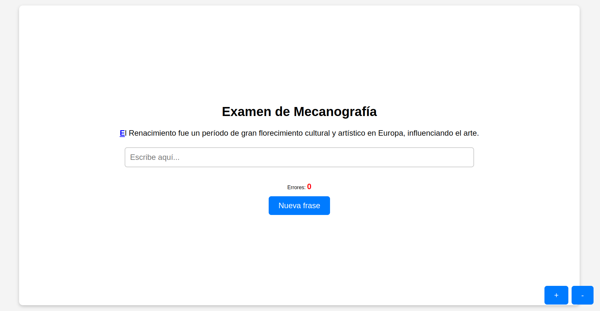

# Examen de Mecanografía

Este proyecto es una aplicación web sencilla diseñada para practicar mecanografía, evaluar errores y medir el rendimiento del usuario.

## Características

- Muestra una frase aleatoria que el usuario debe escribir.
- Resalta la siguiente letra que debe ser escrita.
- Cuenta los errores cometidos durante la escritura.
- Calcula el porcentaje de errores al finalizar la frase.
- Muestra un mensaje emergente (`popup`) con los resultados al completar la frase.
- Permite ajustar el tamaño del texto con botones de zoom (+/-).
- Añade un "velo" semitransparente cuando aparece el `popup`.

## Tecnologías utilizadas

- **HTML5**: Para la estructura de la página.
- **CSS3**: Para el diseño y estilo de los elementos.
- **JavaScript**: Para la lógica de la aplicación.

## Cómo usar

1. Clona o descarga este repositorio.
2. Abre el archivo `index.html` en cualquier navegador moderno.
3. Escribe la frase que aparece en pantalla en el campo de texto.
4. Al finalizar, el sistema mostrará:
   - Número de errores cometidos.
   - Porcentaje de errores.
5. Pulsa el botón de "Nueva frase" para reiniciar el ejercicio.

## Controles

- **Zoom**: Usa los botones `+` y `-` en la parte inferior derecha para ajustar el tamaño del texto y los botones.
- **Nueva frase**: Pulsa el botón para cargar una nueva frase.
- **Escritura**:
  - La siguiente letra requerida se subraya.
  - Si cometes un error, el sistema te notificará y eliminará automáticamente el carácter incorrecto.

## Captura de pantalla



## Personalización

### Añadir frases nuevas

Las frases se encuentran en el arreglo `phrases` dentro del archivo `index.html`. Para añadir frases, simplemente edita la lista:

```javascript
const phrases = ["Nueva frase de ejemplo.", "Otra frase para practicar mecanografía."];
```
